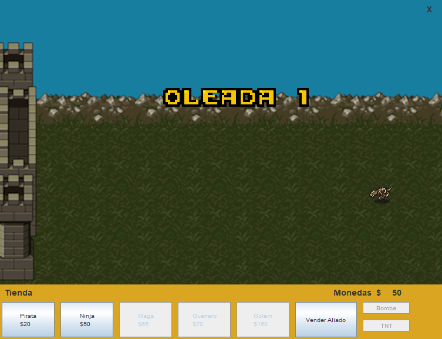

# Castle Defense

### Español
 Éste programa es un videojuego estilo Tower Defense, escrito en lenguaje Java, para el proyecto de la materia "Tecnología de programación", Universidad Nacional del Sur (UNS).
 

 ### English
 This program is a Tower-Defense video game, written in Java language, for the project of the subject "Programming Technology", Universidad Nacional del Sur (UNS).

The goal in this game is to kill the dragon, which comes in the final wave of enemies.
Using the starter gold, you can buy units to defend your castle. You can also sell them. Each of these units have a finite amount of health and damage.
During the game, powerups such as double gold or double damage will spawn. You just have to click on them to activate the powerup.
Have fun!
